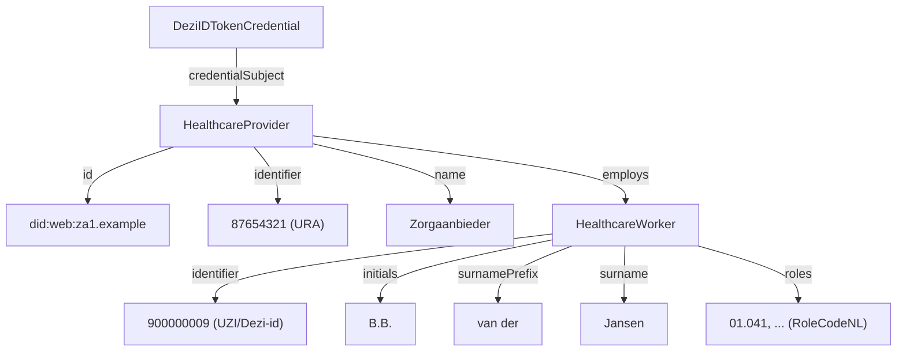

<!--
SPDX-FileCopyrightText: 2026 Steven van der Vegt

SPDX-License-Identifier: EUPL-1.2
-->

### DeziIDTokenCredential

This specification specifies the `DeziIDTokenCredential` and includes steps to create and verify the credential.

The credential is a non-standard credential since it wraps the Dezi OIDC ID-Token and allows a verifier to interact with it like it is a verifiable credential. This allows the information from Dezi to be combined with other credentials during the authentication proces. Ideally the issuer will in time issues the information in a VC format which will makes this specifiation obsolete.

#### Overview

**Purpose**: Assert the identity of a Dezi entity (user) and its relationship to a healthcare provider.

**Issuer**: Dezi

**Subject**: The healthcare provider in the role of employer to the Dezi person.

**Status**: draft

**Terminology:**

| Claim | Code or system |
| ----  | -------------- |
| `HealthcareProvider.identifier` | URA code (UZI Register Abonneenummer) identifying the healthcare organization. OID: `2.16.528.1.1007.3.3` |
| `Employee.identifier` | UZI/Dezi-id code identifying the healthcare worker. OID: `2.16.528.1.1007.3.1` |
| `Employee.roles` | valueset [RoleCodeNL for care givers](https://decor.nictiz.nl/pub/medicatieproces/mp-html-20200122T161947/voc-2.16.840.1.113883.2.4.3.11.60.1.11.2-2018-09-10T000000.html) |

#### Semantic relations

The credential expresses the following graph structure:



#### Example credential

The following is a non-normative example of a `DeziIDTokenCredential`.
It asserts that Healthcare Provider _Medisch centrum_ (URA 87654321) employs _B.B. van der Jansen_ with UZI 87654321 in the roles of Reumatoloog, Verpleegkundige etc.

```json
{
  "@context": [
    "https://www.w3.org/ns/credentials/v2",
    "https://example.org/contexts/dezi/v1"
  ],
  "type": ["VerifiableCredential", "DeziIDTokenCredential"],
  "issuer": "did:web:dezi.nl",
  "validFrom": "2026-31-07T11:15:27Z",
  "validUntil": "2026-30-07T11:16:37Z",
  "credentialSubject": {
    "@type": "HealthcareProvider",
    "id": "did:web:zorgaanbieder.example",
    "identifier": "87654321",
    "name": "Medisch centrum",
    "employee": {
      "@type": "HealthcareWorker",
      "identifier": "900000009",
      "initials": "B.B.",
      "surnamePrefix": "van der",
      "surname": "Jansen",
      "roles": ["01.041", "30.000", "01.010", "01.011"]
    }
  },
  "proof": {
    "type": "DeziIDJWT",
    "jwt": "eyJhbGciOiJSUzI1NiIsImtpZCI6IjFNY2p3cjgxMGpOVUZHVHR6T21MeTRTNnN5cVJ1aVZ1YVM0UmZyWmZwOEk9In0.eyJhdWQiOiIwMDZmYmYzNC1hODBiLTRjODEtYjZlOS01OTM2MDA2NzVmYjIiLCJleHAiOjE3MDE5MzM2OTcsImluaXRpYWxzIjoiQi5CLiIsImlzcyI6Imh0dHBzOi8vbWF4LnByb2VmdHVpbi5EZXppLW9ubGluZS5yZG9iZWhlZXIubmwiLCJsb2FfYXV0aG4iOiJodHRwOi8vZWlkYXMuZXVyb3BhLmV1L0xvQS9oaWdoIiwibG9hX0RlemkiOiJodHRwOi8vZWlkYXMuZXVyb3BhLmV1L0xvQS9oaWdoIiwibmJmIjoxNzAxOTMzNjI3LCJyZWxhdGlvbnMiOlt7ImVudGl0eV9uYW1lIjoiWm9yZ2FhbmJpZWRlciIsInJvbGVzIjpbIjAxLjA0MSIsIjMwLjAwMCIsIjAxLjAxMCIsIjAxLjAxMSJdLCJ1cmEiOiI4NzY1NDMyMSJ9XSwic3VybmFtZSI6IkphbnNlbiIsInN1cm5hbWVfcHJlZml4IjoidmFuIGRlciIsIkRlemlfaWQiOiI5MDAwMDAwMDkifQ.SIGNATURE"
  }
}
```

#### Creating the Credential from a Dezi JWT

To create a `DeziIDTokenCredential` from a Dezi ID-Token JWT, perform the following mapping:

| Credential field | Source | Description |
| ---------------- | ------ | ----------- |
| `@context` | Static | Always `["https://www.w3.org/ns/credentials/v2", "https://example.org/contexts/dezi/v1"]` |
| `type` | Static | Always `["VerifiableCredential", "DeziIDTokenCredential"]` |
| `issuer` | `jwt.iss` | The Dezi issuer, represented as a URL (e.g., `https://max.proeftuin.Dezi-online.rdobeheer.nl`) |
| `validFrom` | `jwt.nbf` | Convert epoch timestamp to ISO 8601 datetime |
| `validUntil` | `jwt.exp` | Convert epoch timestamp to ISO 8601 datetime |
| `credentialSubject.id` | Derived | DID representing the healthcare provider |
| `credentialSubject.identifier` | `jwt.relations[n].ura` | URA of the selected healthcare provider |
| `credentialSubject.name` | `jwt.relations[n].entity_name` | Name of the selected healthcare organization |
| `credentialSubject.employee.identifier` | `jwt.Dezi_id` | The healthcare worker's Dezi/UZI number |
| `credentialSubject.employee.initials` | `jwt.initials` | Initials of the healthcare worker |
| `credentialSubject.employee.surnamePrefix` | `jwt.surname_prefix` | Surname prefix |
| `credentialSubject.employee.surname` | `jwt.surname` | Family name of the healthcare worker |
| `credentialSubject.employee.roles` | `jwt.relations[n].roles` | Role codes for the selected organization |
| `proof.type` | Static | Always `DeziIDJWT` |
| `proof.jwt` | Input | The original signed JWT from Dezi |

**Notes on creation:**

- The JWT may contain multiple entries in `relations[]` (one per organization the worker is associated with). Create one credential per relation, or select the appropriate relation based on context.
- The `credentialSubject.id` should be constructed as a DID that identifies the healthcare provider. The exact method depends on the DID infrastructure in use.
- Timestamps in the JWT (`nbf`, `exp`) are Unix epoch seconds and must be converted to ISO 8601 format.

#### Validation

Validation of this credential is non-typical since the issuer does not issue the credential itself but a signed id-token.
The `proof.type` of this credential is a custom `DeziIDJWT` and contains the JWT as specified in the [April 2024 version](https://www.dezi.nl/documenten/2024/05/08/koppelvlakspecificatie-dezi-online-koppelvlak-1_-platformleverancier) of the Vendor Specification.

Validation consists of the following steps:

1. Verify the JWT following the instructions of Dezi (signature validation using JWKS, expiration checks, etc.)
2. Verify that the values from the credential subject match with the values in the JWT:

| Credential path | JWT path | Validation rule |
| --------------- | -------- | --------------- |
| `vc.issuer` | `jwt.iss` | Must match (after DID resolution if applicable) |
| `vc.validFrom` | `jwt.nbf` | Must be equal (converted to epoch) |
| `vc.validUntil` | `jwt.exp` | Must be equal (converted to epoch) |
| `vc.credentialSubject.identifier` | `jwt.relations[].ura` | At least one relation must have matching URA |
| `vc.credentialSubject.name` | `jwt.relations[].entity_name` | Must match the entity_name of the matching relation |
| `vc.credentialSubject.employee.identifier` | `jwt.uzi_id` or `jwt.Dezi_id` | Must be equal |
| `vc.credentialSubject.employee.initials` | `jwt.initials` | Must be equal |
| `vc.credentialSubject.employee.surnamePrefix` | `jwt.surname_prefix` | Must be equal |
| `vc.credentialSubject.employee.surname` | `jwt.surname` | Must be equal |
| `vc.credentialSubject.employee.roles` | `jwt.relations[].roles` | All credential roles must exist in the roles array of the matching relation |

#### Proof of possession

Normally, VCs bind to a subject through credentialSubject.id, typically a DID that the holder can prove control over (for example, by including the credential in a Verifiable Presentation and signing the VP with an assertion key associated with the DID). This credential differs: Dezi does not verify or include credentialSubject.id in the JWT. The binding is instead through credentialSubject.identifier (the URA code).

To establish proof of possession, the verifier must:

1. Obtain an additional credential that asserts the holder's relationship to the URA identifier
2. Verify that the credentialSubject.identifier in this credential matches the URA asserted in the accompanying credential
3. Verify the holder controls the DID in the accompanying credential through standard proof of possession mechanisms

This means DeziIDTokenCredential cannot be used standalone for authentication. It must be presented alongside a credential that binds the holder's DID to the healthcare provider identifier (URA).

It also means credentialSubject.identifier (the URA) in this credential cannot be treated as a verified claim about the healthcare provider. It is included for structural compatibility with the VC data model, but carries no cryptographic assurance from Dezi.

#### Encoding and Limitations

This credential can only be expressed using JSON or JSON-LD encoding with a custom `DeziIDJWT` proof type. Unlike standard VC proofs, the proof does not contain a signature over the credential. Instead, it embeds the original Dezi ID-Token:

```json
{
  "proof": {
    "type": "DeziIDJWT",
    "jwt": "eyJhbGciOiJSUzI1NiIs..."
  }
}
```

Authenticity is established by validating the embedded JWT according to Dezi specifications, then verifying that credential claims match the JWT claims.

**Why not JWT encoding?** The VC Data Model 1.1 JWT encoding requires the credential issuer to sign the JWT. Since the Dezi JWT is an OIDC ID-Token (not a VC-JWT) and we cannot control its structure, we wrap it instead.

##### Limitations

Since this proof is non-standard, VC libraries might not be able to validate it out of the box and custom validation is required. Also, since claims appear in both the credential and the embedded JWT, the validation needs to check for consistency between the two.
