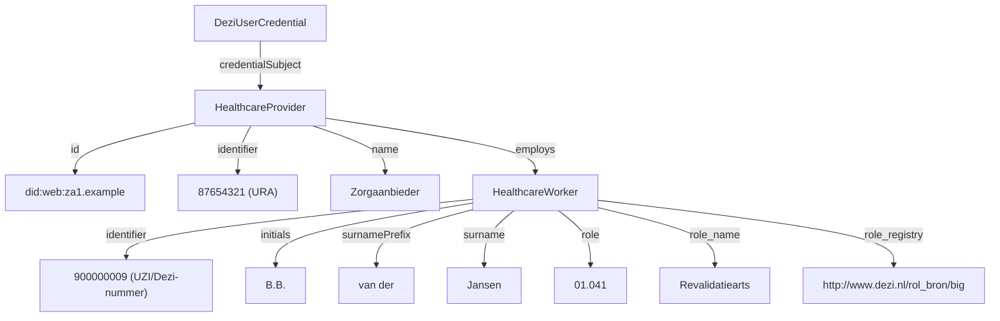

<!--
SPDX-FileCopyrightText: 2026 Steven van der Vegt
SPDX-FileCopyrightText: 2026 Rein Krul

SPDX-License-Identifier: CC-BY-SA-4.0
-->

### DeziUserCredential

This specification specifies the `DeziUserCredential` and includes steps to create and verify the credential.

The credential is a non-standard credential since it wraps the Dezi OIDC ID-Token and allows a verifier to interact with it like it is a verifiable credential. This allows the information from Dezi to be combined with other credentials during the authentication process. Ideally the issuer will in time issue the information in a VC format which will make this specification obsolete.

#### Overview

**Purpose**: Assert the identity of a Dezi entity (user) and its relationship to a healthcare provider.

**Issuer**: Dezi

**Subject**: The healthcare provider in the role of employer to the Dezi person.

**Status**: draft

**Terminology:**

| Claim                           | Code or system                                                                                                                                                             |
|---------------------------------|----------------------------------------------------------------------------------------------------------------------------------------------------------------------------|
| `HealthcareProvider.identifier` | URA code (UZI Register Abonneenummer) identifying the healthcare organization. OID: `2.16.528.1.1007.3.3`                                                                  |
| `Employee.identifier`           | UZI/Dezi-id code identifying the healthcare worker. OID: `2.16.528.1.1007.3.1`                                                                                             |
| `Employee.role`                 | valueset [RoleCodeNL for care givers](https://decor.nictiz.nl/pub/medicatieproces/mp-html-20200122T161947/voc-2.16.840.1.113883.2.4.3.11.60.1.11.2-2018-09-10T000000.html) |
| `Employee.role_name`            | Human-readable name of the role                                                                                                                                            |
| `Employee.role_registry`        | Registry from which the role originates (e.g., `http://www.dezi.nl/rol_bron/big`)                                                                                          |

#### Semantic relations

The credential expresses the following graph structure:


```mermaid
graph TD
    VC[DeziUserCredential]
    VC -->|credentialSubject| HP[HealthcareProvider]
    HP -->|id| DID["did:web:za1.example"]
    HP -->|identifier| URA["87654321 (URA)"]
    HP -->|name| NAME["Zorgaanbieder"]
    HP -->|employs| HW[HealthcareWorker]
    HW -->|identifier| UZI["900000009 (UZI/Dezi-nummer)"]
    HW -->|initials| INIT["B.B."]
    HW -->|surnamePrefix| PRE["van der"]
    HW -->|surname| SUR["Jansen"]
    HW -->|role| ROLE["01.041"]
    HW -->|role_name| ROLENAME["Revalidatiearts"]
    HW -->|role_registry| ROLEREG["http://www.dezi.nl/rol_bron/big"]
```

#### Example credential

The following is a non-normative example of a `DeziUserCredential`.
It asserts that Healthcare Provider _Medisch centrum_ (URA 87654321) employs _B.B. van der Jansen_ with UZI 87654321 in the role of Revalidatiearts.

```json
{
  "@context": [
    "https://www.w3.org/ns/credentials/v2",
    "https://example.org/contexts/dezi/v1"
  ],
  "type": ["VerifiableCredential", "DeziUserCredential"],
  "issuer": "did:web:dezi.nl",
  "validFrom": "2026-31-07T11:15:27Z",
  "validUntil": "2026-30-07T11:16:37Z",
  "credentialSubject": {
    "@type": "HealthcareProvider",
    "id": "did:web:zorgaanbieder.example",
    "identifier": "87654321",
    "name": "Medisch centrum",
    "employee": {
      "@type": "HealthcareWorker",
      "identifier": "900000009",
      "initials": "B.B.",
      "surnamePrefix": "van der",
      "surname": "Jansen",
      "role": "01.041",
      "role_name": "Revalidatiearts",
      "role_registry": "http://www.dezi.nl/rol_bron/big"
    }
  },
  "proof": {
    "type": "DeziIDJWT07",
    "jwt": "eyJhbGciOiJSUzI1NiIsImtpZCI6IjMyNWRlOWFiLTQzMzAtNGMwMS04MjRlLWQ5YmQwYzM3Y2NhMCIsImprdSI6Imh0dHBzOi8vYXV0aC5kZXppLm5sL2p3a3MuanNvbiIsInR5cCI6IkpXVCJ9.eyJqdGkiOiI2MWIxZmFmYy00ZWM3LTQ0ODktYTI4MC04ZDBhNTBhM2Q1YTkiLCJpc3MiOiJhYm9ubmVlLmRlemkubmwiLCJleHAiOjE3NDAxMzExNzYsIm5iZiI6MTczMjE4MjM3NiwianNvbl9zY2hlbWEiOiJodHRwczovL3d3dy5kZXppLm5sL2pzb25fc2NoZW1hcy92MS92ZXJrbGFyaW5nLmpzb24iLCJsb2FfZGV6aSI6Imh0dHA6Ly9laWRhcy5ldXJvcGUuZXUvTG9BL2hpZ2giLCJ2ZXJrbGFyaW5nX2lkIjoiODUzOWY3NWQtNjM0Yy00N2RiLWJiNDEtMjg3OTFkZmQxZjhkIiwiZGV6aV9udW1tZXIiOiI5MDAwMDAwMDkiLCJ2b29ybGV0dGVycyI6IkIuQi4iLCJ2b29ydm9lZ3NlbCI6InZhbiBkZXIiLCJhY2h0ZXJuYWFtIjoiSmFuc2VuIiwiYWJvbm5lZV9udW1tZXIiOiI4NzY1NDMyMSIsImFib25uZWVfbmFhbSI6Ik1lZGlzY2ggY2VudHJ1bSIsInJvbF9jb2RlIjoiMDEuMDQxIiwicm9sX25hYW0iOiJSZXVtYXRvbG9vZyIsInJvbF9jb2RlX2Jyb24iOiJodHRwOi8vd3d3LmRlemkubmwvcm9sX2NvZGVfYnJvbi9iaWciLCJzdGF0dXNfdXJpIjoiaHR0cHM6Ly9hdXRoLmRlemkubmwvc3RhdHVzL3YxL3ZlcmtsYXJpbmcvODUzOWY3NWQtNjM0Yy00N2RiLWJiNDEtMjg3OTFkZmQxZjhkIn0.SIGNATURE"
  }
}
```

#### Creating the Credential from a Dezi Attestation

To create a `DeziUserCredential` from a Dezi attestation, perform the following mapping:

| Credential field                           | Source                         | Description                                                                                    |
|--------------------------------------------|--------------------------------|------------------------------------------------------------------------------------------------|
| `@context`                                 | Static                         | Always `["https://www.w3.org/ns/credentials/v2", "https://example.org/contexts/dezi/v1"]`      |
| `type`                                     | Static                         | Always `["VerifiableCredential", "DeziUserCredential"]`                                        |
| `issuer`                                   | `jwt.iss`                      | The Dezi issuer, represented as a URL (e.g., `https://max.proeftuin.Dezi-online.rdobeheer.nl`) |
| `validFrom`                                | `jwt.nbf`                      | Convert epoch timestamp to ISO 8601 datetime                                                   |
| `validUntil`                               | `jwt.exp`                      | Convert epoch timestamp to ISO 8601 datetime                                                   |
| `credentialSubject.id`                     | Derived                        | DID representing the healthcare provider                                                       |
| `credentialSubject.identifier`             | `jwt.abonnee_nummer`           | Abonnee nummer (URA) of the healthcare provider                                                |
| `credentialSubject.name`                   | `jwt.abonnee_naam`             | Name of the healthcare organization                                                            |
| `credentialSubject.employee.identifier`    | `jwt.dezi_nummer`              | The healthcare worker's Dezi number                                                            |
| `credentialSubject.employee.initials`      | `jwt.voorletters`              | Initials of the healthcare worker                                                              |
| `credentialSubject.employee.surnamePrefix` | `jwt.voorvoegsel`              | Surname prefix                                                                                 |
| `credentialSubject.employee.surname`       | `jwt.achternaam`               | Family name of the healthcare worker                                                           |
| `credentialSubject.employee.role`          | `jwt.verklaring.rol_code`      | Role code for the selected organization                                                        |
| `credentialSubject.employee.role_name`     | `jwt.verklaring.rol_naam`      | Human-readable name of the role                                                                |
| `credentialSubject.employee.role_registry` | `jwt.verklaring.rol_code_bron` | Registry from which the role originates (e.g., `http://www.dezi.nl/rol_bron/big`)              |
| `proof.type`                               | Static                         | Always `DeziIDJWT`                                                                             |
| `proof.jwt`                                | Input                          | The original signed JWT from Dezi                                                              |

**Notes on creation:**

- The `credentialSubject.id` should be constructed as a DID that identifies the healthcare provider. The exact method depends on the DID infrastructure in use.
- Timestamps in the JWT (`nbf`, `exp`) are Unix epoch seconds and must be converted to ISO 8601 format.

#### Validation

Validation of this credential is non-typical since the issuer does not issue the credential itself but a signed attestation.
The `proof.type` of this credential is a custom `DeziIDJWT07` where the `07` suffix indicates that it contains an attestation ("verklaring"), as specified in the [0.7 version](https://www.dezi.nl/documenten/2025/12/15/koppelvlakspecificatie-dezi-voor-platform--en-softwareleveranciers) of the Vendor Specification.

Validation consists of the following steps:

1. Verify the Dezi attestation JWT version (indicated by the credential proof type suffix) is supported by the implementation.
2. Verify the attestation JWT following the instructions of Dezi (signature validation using JWKS from the `jku` header claim, expiration checks, etc.)
3. Verify the revocation status according to Dezi's revocation endpoint.
4. Verify that the values from the credential subject match with the values in the JWT:

| Credential path                               | JWT path                       | Validation rule                                 |
|-----------------------------------------------|--------------------------------|-------------------------------------------------|
| `vc.issuer`                                   | `jwt.iss`                      | Must match (after DID resolution if applicable) |
| `vc.validFrom`                                | `jwt.nbf`                      | Must be equal (converted to epoch)              |
| `vc.validUntil`                               | `jwt.exp`                      | Must be equal (converted to epoch)              |
| `vc.credentialSubject.identifier`             | `jwt.abonnee_nummer`           | Must match the abonnee nummer                   |
| `vc.credentialSubject.name`                   | `jwt.abonnee_naam`             | Must match the abonnee name                     |
| `vc.credentialSubject.employee.identifier`    | `jwt.dezi_nummer`              | Must be equal                                   |
| `vc.credentialSubject.employee.initials`      | `jwt.voorletters`              | Must be equal                                   |
| `vc.credentialSubject.employee.surnamePrefix` | `jwt.voorvoegsel`              | Must be equal (both may be null)                |
| `vc.credentialSubject.employee.surname`       | `jwt.achternaam`               | Must be equal                                   |
| `vc.credentialSubject.employee.role`          | `jwt.verklaring.rol_code`      | Must be equal                                   |
| `vc.credentialSubject.employee.role_name`     | `jwt.verklaring.rol_naam`      | Must be equal                                   |
| `vc.credentialSubject.employee.role_registry` | `jwt.verklaring.rol_code_bron` | Must be equal                                   |

#### Proof of possession

Normally, VCs bind to a subject through credentialSubject.id, typically a DID that the holder can prove control over (for example, by including the credential in a Verifiable Presentation and signing the VP with an assertion key associated with the DID). This credential differs: Dezi does not verify or include credentialSubject.id in the JWT. The binding is instead through credentialSubject.identifier (the URA code).

To establish proof of possession, the verifier must:

1. Obtain an additional credential that asserts the holder's relationship to the URA identifier
2. Verify that the credentialSubject.identifier in this credential matches the URA asserted in the accompanying credential
3. Verify the holder controls the DID in the accompanying credential through standard proof of possession mechanisms

This means DeziUserCredential cannot be used standalone for authentication. It must be presented alongside a credential that binds the holder's DID to the healthcare provider identifier (URA).

It also means credentialSubject.identifier (the URA) in this credential cannot be treated as a verified claim about the healthcare provider. It is included for structural compatibility with the VC data model, but carries no cryptographic assurance from Dezi.

#### Encoding and Limitations

This credential can only be expressed using JSON or JSON-LD encoding with a custom `DeziIDJWT07` proof type (where `07` indicates Dezi v0.7). Unlike standard VC proofs, the proof does not contain a signature over the credential. Instead, it embeds the original Dezi attestation:

```json
{
  "proof": {
    "type": "DeziIDJWT07",
    "jwt": "eyJhbGciOiJSUzI1NiIs..."
  }
}
```

Authenticity is established by validating the embedded attestation JWT according to Dezi specifications, then verifying that credential claims match the JWT claims.

**Why not JWT encoding?** The VC Data Model 1.1 JWT encoding requires the credential issuer to sign the JWT. Since the Dezi attestation is obtained from the OIDC userinfo endpoint (not as a VC-JWT) and we cannot control its structure, we wrap it instead.

##### Limitations

Since this proof is non-standard, VC libraries might not be able to validate it out of the box and custom validation is required. Also, since claims appear in both the credential and the embedded attestation JWT, the validation needs to check for consistency between the two.
