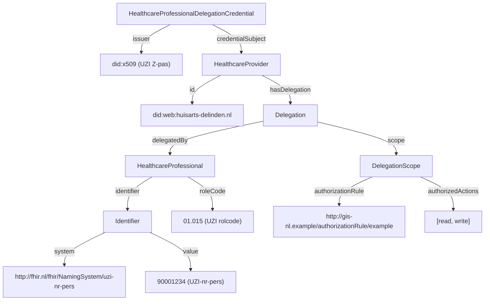

<!--
SPDX-FileCopyrightText: 2026 Steven van der Vegt

SPDX-License-Identifier: CC-BY-SA-4.0
-->

### HealthcareProfessionalDelegationCredential

The `HealthcareProfessionalDelegationCredential` proves that a healthcare professional delegates authority to a healthcare provider.
It is the Verifiable Credential counterpart of the AORTA SAML mandate token (`mandaattoken`).
The healthcare professional signs the credential with the signing key of their UZI healthcare professional pass.

#### Overview

**Purpose**: Assert that a healthcare professional has delegated a defined set of authorized actions to a healthcare provider, within the scope of an authorization rule from the applicable agreement framework (`afspraakstelsel`).

**Issuer**: `did:x509` of the healthcare professional that signs the credential. The certificate MUST be a UZI healthcare professional pass (pastype `Z`).

**Subject**: `did:web` of the healthcare provider within which the mandate is valid.

**Status**: draft

**VC type**: `["VerifiableCredential", "HealthcareProfessionalDelegationCredential"]`

**Trust anchors**: PKIoverheid intermediate CAs for UZI healthcare professional passes, or future GIS-VN intermediate CAs.

#### Background

This credential replaces the AORTA SAML mandate token used to delegate authority from a healthcare professional to a healthcare provider.

The credential carries no claim about the URA number of the healthcare provider: the issuer (an individual healthcare professional) cannot make a claim about the URA number of the organization. The binding between the subject `did:web` and the URA number must be established through an additional credential presented in the same Verifiable Presentation.

By signing the credential with their UZI Z-pas, the healthcare professional makes a personal claim about the scope of the delegation: the authorization rule and the set of authorized actions.

#### Attributes

All fields below are scoped to `credentialSubject`.

<table class="grid">
  <thead>
    <tr>
      <th>Path</th>
      <th>IRI</th>
      <th>Card.</th>
      <th>Description / validation</th>
    </tr>
  </thead>
  <tbody>
    <tr>
      <td><code>id</code></td>
      <td>-</td>
      <td>1</td>
      <td><code>did:web</code> of the healthcare provider</td>
    </tr>
    <tr>
      <td><code>@type</code></td>
      <td><code>gis:HealthcareProvider</code></td>
      <td>1</td>
      <td>Always <code>HealthcareProvider</code></td>
    </tr>
    <tr>
      <td><code>hasDelegation.@type</code></td>
      <td><code>gis:Delegation</code></td>
      <td>1</td>
      <td>Always <code>Delegation</code></td>
    </tr>
    <tr>
      <td><code>hasDelegation.delegatedBy.@type</code></td>
      <td><code>gis:HealthcareProfessional</code></td>
      <td>1</td>
      <td>Always <code>HealthcareProfessional</code></td>
    </tr>
    <tr>
      <td><code>hasDelegation.delegatedBy.identifier.@type</code></td>
      <td><code>schema:PropertyValue</code></td>
      <td>1</td>
      <td>Always <code>Identifier</code></td>
    </tr>
    <tr>
      <td><code>hasDelegation.delegatedBy.identifier.system</code></td>
      <td><code>schema:propertyID</code></td>
      <td>1</td>
      <td>Always <code>http://fhir.nl/fhir/NamingSystem/uzi-nr-pers</code></td>
    </tr>
    <tr>
      <td><code>hasDelegation.delegatedBy.identifier.value</code></td>
      <td><code>schema:value</code></td>
      <td>1</td>
      <td>UZI number of the healthcare professional; MUST correspond to the UZI number in the issuer DID</td>
    </tr>
    <tr>
      <td><code>hasDelegation.delegatedBy.roleCode</code></td>
      <td><code>gis:roleCode</code></td>
      <td>1</td>
      <td>UZI role code of the healthcare professional; MUST correspond to the role code in the issuer DID</td>
    </tr>
    <tr>
      <td><code>hasDelegation.scope.@type</code></td>
      <td><code>gis:DelegationScope</code></td>
      <td>1</td>
      <td>Always <code>DelegationScope</code></td>
    </tr>
    <tr>
      <td><code>hasDelegation.scope.authorizationRule</code></td>
      <td><code>gis:authorizationRule</code></td>
      <td>1</td>
      <td>URI of the authorization rule under which the mandate is issued</td>
    </tr>
    <tr>
      <td><code>hasDelegation.scope.authorizedActions</code></td>
      <td><code>gis:authorizedActions</code></td>
      <td>1..*</td>
      <td>Authorized actions within the authorization rule</td>
    </tr>
  </tbody>
</table>

The set of valid values for `authorizationRule` and `authorizedActions` is determined by the applicable agreement framework (`afspraakstelsel`) and is yet to be decided.

#### Semantic relations

The credential expresses the following entity model:



#### JSON-LD Context

The credential uses the GIS JSON-LD context, which is shared across GIS credentials:

```json
{
  "@context": {
    "gis": "http://gis-nl.example/",
    "schema": "http://schema.org/",

    "HealthcareProvider": "gis:HealthcareProvider",
    "HealthcareProfessional": "gis:HealthcareProfessional",
    "HealthcareWorker": "gis:HealthcareWorker",
    "Patient": "gis:Patient",
    "ServiceProvider": "gis:ServiceProvider",

    "Delegation": "gis:Delegation",
    "DelegationScope": "gis:DelegationScope",
    "PatientEnrollment": "gis:PatientEnrollment",

    "Identifier": "schema:PropertyValue",
    "identifier": {
      "@id": "schema:identifier",
      "@container": "@set"
    },
    "system": "schema:propertyID",
    "value": "schema:value",
    "roleCode": {
      "@id": "gis:roleCode",
      "@type": "http://fhir.nl/fhir/NamingSystem/uzi-rolcode"
    },
    "name": "schema:name",

    "hasDelegation": "gis:hasDelegation",
    "delegatedBy": "gis:delegatedBy",
    "scope": "gis:scope",
    "authorizationRule": "gis:authorizationRule",
    "authorizedActions": "gis:authorizedActions",
    "hasEnrollment": "gis:hasEnrollment",
    "patient": "gis:patient",
    "enrolledBy": "gis:enrolledBy",
    "services": "gis:services"
  }
}
```

#### Example credential

The following is a non-normative example of a `HealthcareProfessionalDelegationCredential` using the [W3C Verifiable Credentials Data Model 1.1](https://www.w3.org/TR/vc-data-model-1.1/#json-web-token) JWT encoding. It asserts that the healthcare professional with UZI `90001234` (role code `01.015`) has delegated the actions `read` and `write` to the healthcare provider identified by `did:web:huisarts-delinden.nl`.

The values used for `authorizationRule` and `authorizedActions` are placeholders; actual values are governed by the applicable agreement framework.

JWT Header:

```json
{
  "alg": "PS256",
  "typ": "JWT",
  "kid": "did:x509:0:sha256:YmFzZTY0...dHJ1c3Q=::san:otherName:2.16.528.1.1007.99.2110-1-12345678-Z-90001234-01.015-12345678#0",
  "x5c": [
    "MIIFjDCCA3SgAwIBAgIUe8Y...kortLeafCert...==",
    "MIIFcDCCA1igAwIBAgIUa5B...kortIntermediateCert...==",
    "MIIFZDCCAxygAwIBAgIUbGp...kortRootCert...=="
  ],
  "x5t#S256": "dGhpcyBpcyBhIGV4YW1wbGUgdGh1bWJwcmludA"
}
```

JWT Payload:

```json
{
  "iss": "did:x509:0:sha256:YmFzZTY0...dHJ1c3Q=::san:otherName:2.16.528.1.1007.99.2110-1-12345678-Z-90001234-01.015-12345678",
  "sub": "did:web:huisarts-delinden.nl",
  "jti": "urn:uuid:b2c3d4e5-f6a7-8901-bcde-f23456789012",
  "nbf": 1740000000,
  "exp": 1786320000,
  "vc": {
    "@context": [
      "https://www.w3.org/2018/credentials/v1",
      "http://gis-nl.example/"
    ],
    "type": [
      "VerifiableCredential",
      "HealthcareProfessionalDelegationCredential"
    ],
    "issuanceDate": "2025-02-20T00:00:00Z",
    "expirationDate": "2026-08-08T00:00:00Z",
    "credentialSubject": {
      "id": "did:web:huisarts-delinden.nl",
      "@type": "HealthcareProvider",
      "hasDelegation": {
        "@type": "Delegation",
        "delegatedBy": {
          "@type": "HealthcareProfessional",
          "identifier": [{
            "@type": "Identifier",
            "system": "http://fhir.nl/fhir/NamingSystem/uzi-nr-pers",
            "value": "90001234"
          }],
          "roleCode": "01.015"
        },
        "scope": {
          "@type": "DelegationScope",
          "authorizationRule": "http://gis-nl.example/authorizationRule/example",
          "authorizedActions": ["read", "write"]
        }
      }
    }
  }
}
```

#### Validation

In addition to the generic validation steps from the [Credential Catalog](credential-catalog.html#profile), verifiers MUST perform the following checks:

1. The issuer is a `did:x509` DID anchored in a trusted PKIoverheid intermediate CA for UZI healthcare professional passes (or a future GIS-VN intermediate CA).
2. The pastype encoded in the issuer `did:x509` MUST be `Z` (healthcare professional pass). Other pastypes (e.g. `N` for named employee passes) MUST be rejected.
3. The UZI number in `credentialSubject.hasDelegation.delegatedBy.identifier.value` MUST correspond to the UZI number encoded in the issuer `did:x509`.
4. The UZI role code in `credentialSubject.hasDelegation.delegatedBy.roleCode` MUST correspond to the role code encoded in the issuer `did:x509`.
5. The credential `expirationDate` MUST be on or before the `notAfter` date of the signing key's certificate.
6. The values for `authorizationRule` and `authorizedActions` MUST be valid within the applicable agreement framework.

#### Example use cases

- A healthcare professional delegating a defined set of actions to the healthcare provider they work for, replacing the AORTA SAML mandate token.
- A healthcare provider presenting proof of a personal mandate from a healthcare professional when requesting access to data held by another care organization, in addition to the organisational credentials of the requesting party.
