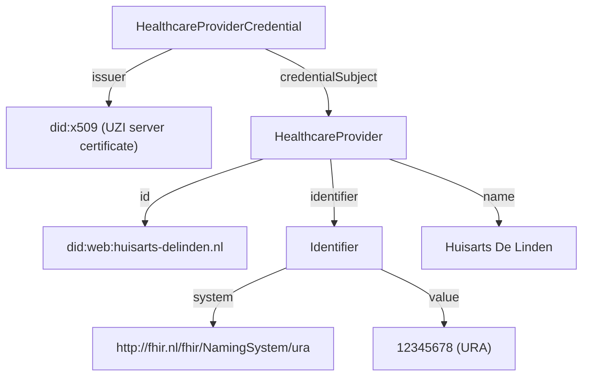

<!--
SPDX-FileCopyrightText: 2026 Rein Krul

SPDX-License-Identifier: CC-BY-SA-4.0
-->

### HealthcareProviderCredential

The `HealthcareProviderCredential` proves that a healthcare provider can be uniquely identified within the agreement framework (`afspraakstelsel`) by its URA number (`UZI-register Abonneenummer`).
It identifies the healthcare provider but carries no authorization information itself.

The credential is built from the healthcare provider's UZI server certificate through the `did:x509` DID method.

#### Overview

**Purpose**: Assert the identity of a healthcare provider through its URA number, bound to a `did:web` subject.

**Issuer**: `did:x509` of the healthcare provider, anchored in a trusted UZI server certificate. The pastype encoded in the issuer DID MUST be `S` (UZI server certificate).

**Subject**: `did:web` of the healthcare provider.

**Status**: draft

**Data model**: [W3C Verifiable Credentials Data Model 1.1](https://www.w3.org/TR/vc-data-model-1.1/)

**VC type**: `["VerifiableCredential", "HealthcareProviderCredential"]`

**Proof type**: [JWT](https://www.w3.org/TR/vc-data-model-1.1/#json-web-token)

**Signature algorithm**: `RS256`. RS256 is used solely for compatibility with existing UZI certificates and hardware that does not support RSASSA-PSS.

**Revocation method**: certificate revocation checks (OCSP/CRL) through the `did:x509` DID resolution, and optionally [Bitstring Status List v1.0](https://www.w3.org/TR/vc-bitstring-status-list/) via the `credentialStatus` field (not currently used).

**Proof of Possession**: presenter is holder: the identifier of the presenter MUST equal the credential subject identifier.

**Trust anchors**: PKIoverheid intermediate CAs for UZI server certificates. The subject `did:web` MUST use a `.nl` top-level domain.

#### Background

This credential gives a healthcare provider a stable, semantic identity (its URA number) within the agreement framework, bound to the `did:web` the provider uses in the network. It builds directly on UZI server certificate material through the `did:x509` DID method: the URA in `credentialSubject.identifier.value` MUST correspond to the URA encoded in the issuer certificate's `san:otherName` attribute.

##### Relationship to the X509Credential

The [`X509Credential`](credential-X509Credential.html) is a generic credential that exposes the raw attributes of an X.509 certificate (the `subject`, `san` and `eku` DID policies) without assigning them domain semantics. The `HealthcareProviderCredential` is purpose-built: it asserts specifically the URA identifier (and optionally the name) of a healthcare provider using FHIR `NamingSystem` semantics, rather than exposing raw certificate policy fields. Both are issued from `did:x509` UZI material; a verifier that needs the typed URA claim SHOULD rely on the `HealthcareProviderCredential`.

#### Attributes

All fields below are scoped to `credentialSubject`.

<table class="grid">
  <thead>
    <tr>
      <th>Path</th>
      <th>IRI</th>
      <th>Card.</th>
      <th>Description / validation</th>
    </tr>
  </thead>
  <tbody>
    <tr>
      <td><code>id</code></td>
      <td>-</td>
      <td>0..1</td>
      <td><code>did:web</code> of the healthcare provider; if present, MUST equal the <code>sub</code> claim</td>
    </tr>
    <tr>
      <td><code>@type</code></td>
      <td><code>gis:HealthcareProvider</code></td>
      <td>1</td>
      <td>Always <code>HealthcareProvider</code></td>
    </tr>
    <tr>
      <td><code>identifier.@type</code></td>
      <td><code>schema:PropertyValue</code></td>
      <td>1</td>
      <td>Always <code>Identifier</code></td>
    </tr>
    <tr>
      <td><code>identifier.system</code></td>
      <td><code>schema:propertyID</code></td>
      <td>1</td>
      <td>Always <code>http://fhir.nl/fhir/NamingSystem/ura</code></td>
    </tr>
    <tr>
      <td><code>identifier.value</code></td>
      <td><code>schema:value</code></td>
      <td>1</td>
      <td>URA number of the healthcare provider; MUST correspond to the URA in the issuer certificate's <code>san:otherName</code></td>
    </tr>
    <tr>
      <td><code>name</code></td>
      <td><code>schema:name</code></td>
      <td>0..1</td>
      <td>Name of the healthcare provider; if present, MUST equal the issuer certificate's <code>subject:O</code></td>
    </tr>
  </tbody>
</table>

#### Semantic relations

The credential expresses the following entity model:



#### JSON-LD Context

The credential uses the GIS JSON-LD context, which is shared across GIS credentials:

```json
{
  "@context": {
    "gis": "http://gis-nl.example/",
    "schema": "http://schema.org/",

    "HealthcareProvider": "gis:HealthcareProvider",
    "HealthcareProfessional": "gis:HealthcareProfessional",
    "HealthcareWorker": "gis:HealthcareWorker",
    "Patient": "gis:Patient",
    "ServiceProvider": "gis:ServiceProvider",

    "Delegation": "gis:Delegation",
    "DelegationScope": "gis:DelegationScope",
    "PatientEnrollment": "gis:PatientEnrollment",

    "Identifier": "schema:PropertyValue",
    "identifier": {
      "@id": "schema:identifier",
      "@container": "@set"
    },
    "system": "schema:propertyID",
    "value": "schema:value",
    "roleCode": {
      "@id": "gis:roleCode",
      "@type": "http://fhir.nl/fhir/NamingSystem/uzi-rolcode"
    },
    "name": "schema:name",

    "hasDelegation": "gis:hasDelegation",
    "issuedTo": "gis:issuedTo",
    "issuedBy": "gis:issuedBy",
    "delegatedBy": "gis:delegatedBy",
    "scope": "gis:scope",
    "authorizationRule": "gis:authorizationRule",
    "authorizedActions": "gis:authorizedActions",
    "hasEnrollment": "gis:hasEnrollment",
    "patient": "gis:patient",
    "enrolledBy": "gis:enrolledBy",
    "services": "gis:services"
  }
}
```

#### Example credential

The following is a non-normative example of a `HealthcareProviderCredential` using the [W3C Verifiable Credentials Data Model 1.1](https://www.w3.org/TR/vc-data-model-1.1/#json-web-token) JWT encoding. It asserts that the healthcare provider identified by `did:web:huisarts-delinden.nl` has URA `12345678`.

JWT Header:

```json
{
  "alg": "RS256",
  "typ": "JWT",
  "kid": "did:x509:0:sha256:YmFzZTY0...dHJ1c3Q=::subject:O:Huisarts%20De%20Linden::san:otherName:2.16.528.1.1007.99.2110-1-12345678-S-90000382-00.000-12345678#0",
  "x5c": [
    "MIIFjDCCA3SgAwIBAgIUe8Y...kortLeafCert...==",
    "MIIFcDCCA1igAwIBAgIUa5B...kortIntermediateCert...==",
    "MIIFZDCCAxygAwIBAgIUbGp...kortRootCert...=="
  ],
  "x5t#S256": "dGhpcyBpcyBhIGV4YW1wbGUgdGh1bWJwcmludA"
}
```

JWT Payload:

```json
{
  "iss": "did:x509:0:sha256:YmFzZTY0...dHJ1c3Q=::subject:O:Huisarts%20De%20Linden::san:otherName:2.16.528.1.1007.99.2110-1-12345678-S-90000382-00.000-12345678",
  "sub": "did:web:huisarts-delinden.nl",
  "jti": "urn:uuid:3e671c46-7a3b-4c1e-9b2a-4f8e6d2c1a5b",
  "nbf": 1740000000,
  "exp": 1786320000,
  "vc": {
    "@context": [
      "https://www.w3.org/2018/credentials/v1",
      "http://gis-nl.example/"
    ],
    "type": [
      "VerifiableCredential",
      "HealthcareProviderCredential"
    ],
    "issuanceDate": "2025-02-20T00:00:00Z",
    "expirationDate": "2026-08-08T00:00:00Z",
    "credentialSubject": {
      "id": "did:web:huisarts-delinden.nl",
      "@type": "HealthcareProvider",
      "identifier": {
        "@type": "Identifier",
        "system": "http://fhir.nl/fhir/NamingSystem/ura",
        "value": "12345678"
      },
      "name": "Huisarts De Linden"
    }
  }
}
```

#### Validation

In addition to the generic validation steps from the [Credential Catalog](credential-catalog.html#profile), verifiers MUST perform the following checks:

1. The issuer is a `did:x509` DID anchored in a trusted PKIoverheid intermediate CA for UZI server certificates.
2. The pastype encoded in the issuer `did:x509` MUST be `S` (UZI server certificate). Other pastypes MUST be rejected.
3. The URA in `credentialSubject.identifier.value` MUST correspond to the URA encoded in the issuer certificate's `san:otherName`.
4. The `name` (if present) MUST equal the issuer certificate's `subject:O`.
5. The `sub` claim matches `credentialSubject.id` (if present).
6. The credential time validity:
   - `issuanceDate` is equal to or later than the certificate's `notBefore`
   - `expirationDate` (if present) is equal to or earlier than the certificate's `notAfter`

#### Example use cases

- A healthcare provider establishing its organisational identity (URA) in the network, bound to its `did:web`.
- A data holder resolving the URA number of a requesting healthcare provider to apply authorization policy.

#### Trust Anchors

The credential is validated against the PKIoverheid trust chain for UZI server certificates. Refer to [https://cert.pkioverheid.nl/](https://cert.pkioverheid.nl/) for the certificates.
