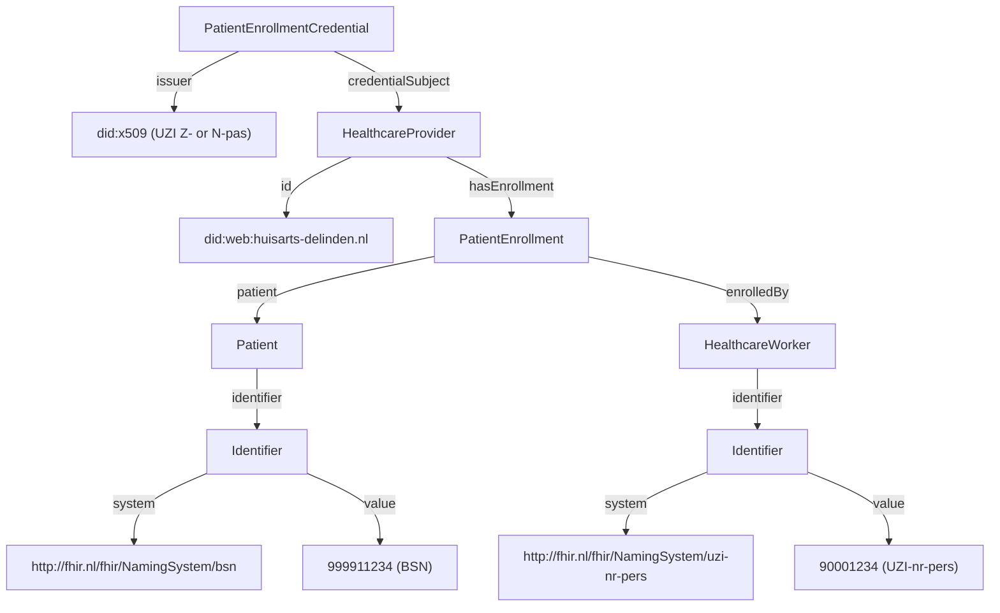

<!--
SPDX-FileCopyrightText: 2026 Steven van der Vegt
SPDX-FileCopyrightText: 2026 Rein Krul

SPDX-License-Identifier: CC-BY-SA-4.0
-->

### PatientEnrollmentCredential

The `PatientEnrollmentCredential` proves that a patient is enrolled with a healthcare provider organization.
It is the Verifiable Credential counterpart of the AORTA SAML enrollment token (`inschrijftoken`).
The credential is signed by a healthcare professional or named employee who has performed the BSN validation.

It is one way of asserting a patient care-giving relationship between a patient and a healthcare provider, which is a legal basis requirement for some healthcare data exchanges.

#### Overview

**Purpose**: Assert that a patient (identified by BSN) is enrolled with a healthcare provider organization, signed by the healthcare worker who performed the BSN validation. The credential establishes a patient care-giving relationship that can serve as the legal basis for subsequent healthcare data exchanges.

**Issuer**: `did:x509` of the healthcare professional or named employee that signs the credential. The certificate MUST be a UZI healthcare professional pass (pastype `Z`) or a named employee pass (pastype `N`).

**Subject**: `did:web` of the healthcare provider organization the patient is enrolled with.

**Status**: draft

**VC type**: `["VerifiableCredential", "PatientEnrollmentCredential"]`

**Trust anchors**: PKIoverheid intermediate CAs for UZI healthcare professional and named employee passes, or future GIS-VN intermediate CAs.

#### Background

This credential replaces the AORTA SAML enrollment token used to register a patient with a care organization. The signer (a healthcare worker on a Z- or N-pas) takes responsibility for the BSN validation procedure.

The credential carries no claim about the URA number of the healthcare provider: the issuer (an individual healthcare worker) cannot make a claim about the URA number of the organization. The binding between the subject `did:web` and the URA number is established through a separate `HealthcareProviderCredential` presented in the same Verifiable Presentation.

The `HealthcareWorker` type is used regardless of whether the signer holds a healthcare professional pass (pastype `Z`) or a named employee pass (pastype `N`). Since `HealthcareProfessional` is a subtype of `HealthcareWorker`, both cases are covered. The role code is not relevant to the enrollment and is therefore not included.

#### Attributes

All fields below are scoped to `credentialSubject`.

<table class="grid">
  <thead>
    <tr>
      <th>Path</th>
      <th>IRI</th>
      <th>Description / validation</th>
    </tr>
  </thead>
  <tbody>
    <tr>
      <td><code>id</code></td>
      <td>-</td>
      <td><code>did:web</code> of the healthcare provider organization</td>
    </tr>
    <tr>
      <td><code>@type</code></td>
      <td><code>gis:HealthcareProvider</code></td>
      <td>Always <code>HealthcareProvider</code></td>
    </tr>
    <tr>
      <td><code>hasEnrollment.@type</code></td>
      <td><code>gis:PatientEnrollment</code></td>
      <td>Always <code>PatientEnrollment</code></td>
    </tr>
    <tr>
      <td><code>hasEnrollment.patient.@type</code></td>
      <td><code>gis:Patient</code></td>
      <td>Always <code>Patient</code></td>
    </tr>
    <tr>
      <td><code>hasEnrollment.patient.identifier.@type</code></td>
      <td><code>schema:PropertyValue</code></td>
      <td>Always <code>Identifier</code></td>
    </tr>
    <tr>
      <td><code>hasEnrollment.patient.identifier.system</code></td>
      <td><code>schema:propertyID</code></td>
      <td>Always <code>http://fhir.nl/fhir/NamingSystem/bsn</code></td>
    </tr>
    <tr>
      <td><code>hasEnrollment.patient.identifier.value</code></td>
      <td><code>schema:value</code></td>
      <td>BSN of the patient</td>
    </tr>
    <tr>
      <td><code>hasEnrollment.enrolledBy.@type</code></td>
      <td><code>gis:HealthcareWorker</code></td>
      <td>Always <code>HealthcareWorker</code></td>
    </tr>
    <tr>
      <td><code>hasEnrollment.enrolledBy.identifier.@type</code></td>
      <td><code>schema:PropertyValue</code></td>
      <td>Always <code>Identifier</code></td>
    </tr>
    <tr>
      <td><code>hasEnrollment.enrolledBy.identifier.system</code></td>
      <td><code>schema:propertyID</code></td>
      <td>Always <code>http://fhir.nl/fhir/NamingSystem/uzi-nr-pers</code></td>
    </tr>
    <tr>
      <td><code>hasEnrollment.enrolledBy.identifier.value</code></td>
      <td><code>schema:value</code></td>
      <td>UZI number of the executor; MUST correspond to the UZI number in the issuer DID</td>
    </tr>
  </tbody>
</table>

#### Semantic relations

The credential expresses the following entity model:



#### JSON-LD Context

The credential uses the GIS JSON-LD context, which is shared across GIS credentials:

```json
{
  "@context": {
    "gis": "http://gis-nl.example/",
    "schema": "http://schema.org/",

    "HealthcareProvider": "gis:HealthcareProvider",
    "HealthcareProfessional": "gis:HealthcareProfessional",
    "HealthcareWorker": "gis:HealthcareWorker",
    "Patient": "gis:Patient",
    "ServiceProvider": "gis:ServiceProvider",

    "Delegation": "gis:Delegation",
    "DelegationScope": "gis:DelegationScope",
    "PatientEnrollment": "gis:PatientEnrollment",

    "Identifier": "schema:PropertyValue",
    "identifier": {
      "@id": "schema:identifier",
      "@container": "@set"
    },
    "system": "schema:propertyID",
    "value": "schema:value",
    "roleCode": {
      "@id": "gis:roleCode",
      "@type": "http://fhir.nl/fhir/NamingSystem/uzi-rolcode"
    },
    "name": "schema:name",

    "hasDelegation": "gis:hasDelegation",
    "delegatedBy": "gis:delegatedBy",
    "scope": "gis:scope",
    "authorizationRule": "gis:authorizationRule",
    "authorizedActions": "gis:authorizedActions",
    "hasEnrollment": "gis:hasEnrollment",
    "patient": "gis:patient",
    "enrolledBy": "gis:enrolledBy",
    "services": "gis:services"
  }
}
```

#### Example credential

The following is a non-normative example of a `PatientEnrollmentCredential` using the [W3C Verifiable Credentials Data Model 1.1](https://www.w3.org/TR/vc-data-model-1.1/#json-web-token) JWT encoding. It asserts that the patient with BSN `999911234` is enrolled with the healthcare provider identified by `did:web:huisarts-delinden.nl`, as registered by a healthcare worker with UZI `90001234`.

JWT Header:

```json
{
  "alg": "PS256",
  "typ": "JWT",
  "kid": "did:x509:0:sha256:YmFzZTY0...dHJ1c3Q=::san:otherName:2.16.528.1.1007.99.2110-1-12345678-Z-90001234-01.015-12345678#0",
  "x5c": [
    "MIIFjDCCA3SgAwIBAgIUe8Y...kortLeafCert...==",
    "MIIFcDCCA1igAwIBAgIUa5B...kortIntermediateCert...==",
    "MIIFZDCCAxygAwIBAgIUbGp...kortRootCert...=="
  ],
  "x5t#S256": "dGhpcyBpcyBhIGV4YW1wbGUgdGh1bWJwcmludA"
}
```

JWT Payload:

```json
{
  "iss": "did:x509:0:sha256:YmFzZTY0...dHJ1c3Q=::san:otherName:2.16.528.1.1007.99.2110-1-12345678-Z-90001234-01.015-12345678",
  "sub": "did:web:huisarts-delinden.nl",
  "jti": "urn:uuid:a1b2c3d4-e5f6-7890-abcd-ef1234567890",
  "nbf": 1740000000,
  "exp": 1786320000,
  "vc": {
    "@context": [
      "https://www.w3.org/2018/credentials/v1",
      "http://gis-nl.example/"
    ],
    "type": [
      "VerifiableCredential",
      "PatientEnrollmentCredential"
    ],
    "issuanceDate": "2025-02-20T00:00:00Z",
    "expirationDate": "2026-08-08T00:00:00Z",
    "credentialSubject": {
      "id": "did:web:huisarts-delinden.nl",
      "@type": "HealthcareProvider",
      "hasEnrollment": {
        "@type": "PatientEnrollment",
        "patient": {
          "@type": "Patient",
          "identifier": [{
            "@type": "Identifier",
            "system": "http://fhir.nl/fhir/NamingSystem/bsn",
            "value": "999911234"
          }]
        },
        "enrolledBy": {
          "@type": "HealthcareWorker",
          "identifier": [{
            "@type": "Identifier",
            "system": "http://fhir.nl/fhir/NamingSystem/uzi-nr-pers",
            "value": "90001234"
          }]
        }
      }
    },
    "credentialStatus": {
      "id": "https://credential-service.eat-europe.nl/statuslist/zv-90001234#4521",
      "type": "StatusList2021Entry",
      "statusPurpose": "revocation",
      "statusListIndex": "4521",
      "statusListCredential": "https://credential-service.eat-europe.nl/statuslist/zv-90001234"
    }
  }
}
```

#### Validation

In addition to the generic validation steps from the [Credential Catalog](credential-catalog.html#profile), verifiers MUST perform the following checks:

1. The issuer is a `did:x509` DID anchored in a trusted PKIoverheid intermediate CA for UZI healthcare professional or named employee passes (or a future GIS-VN intermediate CA).
2. The pastype encoded in the issuer `did:x509` MUST be `Z` (healthcare professional pass) or `N` (named employee pass). Other pastypes (e.g. `M` for non-named employee passes) MUST be rejected.
3. The UZI number in `credentialSubject.hasEnrollment.enrolledBy.identifier.value` MUST correspond to the UZI number encoded in the issuer `did:x509`.
4. The validity period of the credential (`expirationDate` − `issuanceDate`) MUST NOT exceed 18 months, conforming to current AORTA policy for enrollment tokens.

The CRL policy for enrollment tokens is handled by the generic key resolution (see [Authentication](authentication.html)): the key is resolved based on the `issuanceDate` of the credential. If the key was valid and not revoked at that time, the signature remains valid even if the key is later revoked.

#### Example use cases

- Asserting a patient care-giving relationship as a legal basis for cross-organisational healthcare data exchanges.
- A healthcare provider organization presenting proof that a patient is enrolled with them when requesting access to data held by another care organization, replacing the AORTA SAML enrollment token.
