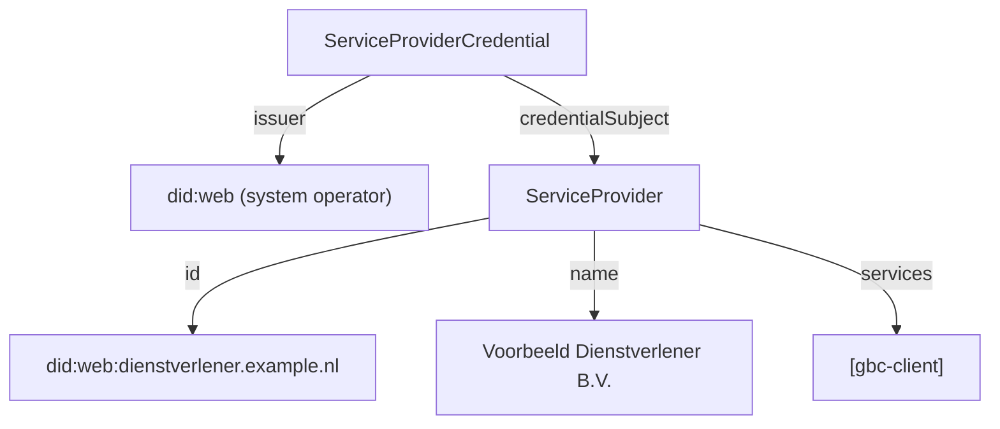

<!--
SPDX-FileCopyrightText: 2026 Rein Krul

SPDX-License-Identifier: CC-BY-SA-4.0
-->

### ServiceProviderCredential

The `ServiceProviderCredential` proves that a service provider is authorized within the agreement framework (`afspraakstelsel`) and competent to provide one or more of its services.
It establishes the system context of a service provider and is consumed before an access token is issued.

It does not assert any authority to act on behalf of a healthcare provider; that delegation is recorded separately in the [`ServiceProviderDelegationCredential`](credential-ServiceProviderDelegationCredential.html).

#### Overview

**Purpose**: Assert that a service provider is authorized within the agreement framework and is competent to provide a defined set of services.

**Issuer**: `did:web` of the system operator (`stelselhouder`) that governs the agreement framework.

**Subject**: `did:web` of the service provider.

**Status**: draft

**Data model**: [W3C Verifiable Credentials Data Model 1.1](https://www.w3.org/TR/vc-data-model-1.1/)

**VC type**: `["VerifiableCredential", "ServiceProviderCredential"]`

**Proof type**: [JWT](https://www.w3.org/TR/vc-data-model-1.1/#json-web-token)

**Signature algorithm**: `ES256` (recommended) or `ES512`

**Revocation method**: [Bitstring Status List v1.0](https://www.w3.org/TR/vc-bitstring-status-list/) via the optional `credentialStatus` field (not currently used).

**Proof of Possession**: presenter is holder: the identifier of the presenter MUST equal the credential subject identifier.

**Trust anchors**: the system operator (`stelselhouder`) of the agreement framework. Framework-specific issuer and trust requirements are defined per agreement framework; see [Agreement framework specifics](#agreement-framework-specifics).

#### Background

This credential provides the application and service context of a service provider. It confirms that the service provider is authorized within the agreement framework, not that it may act on behalf of a particular healthcare provider. The authority to act on behalf of a healthcare provider is carried by the [`ServiceProviderDelegationCredential`](credential-ServiceProviderDelegationCredential.html).

The set of valid values for `services` is determined by the applicable agreement framework (`afspraakstelsel`); see [Agreement framework specifics](#agreement-framework-specifics) for the AORTA service definitions.

#### Attributes

All fields below are scoped to `credentialSubject`.

<table class="grid">
  <thead>
    <tr>
      <th>Path</th>
      <th>IRI</th>
      <th>Card.</th>
      <th>Description / validation</th>
    </tr>
  </thead>
  <tbody>
    <tr>
      <td><code>id</code></td>
      <td>-</td>
      <td>0..1</td>
      <td><code>did:web</code> of the service provider; if present, MUST equal the <code>sub</code> claim</td>
    </tr>
    <tr>
      <td><code>@type</code></td>
      <td><code>gis:ServiceProvider</code></td>
      <td>1</td>
      <td>Always <code>ServiceProvider</code></td>
    </tr>
    <tr>
      <td><code>name</code></td>
      <td><code>schema:name</code></td>
      <td>1</td>
      <td>Legal name of the service provider</td>
    </tr>
    <tr>
      <td><code>services</code></td>
      <td><code>gis:services</code></td>
      <td>1..*</td>
      <td>Services the service provider is competent to provide, as defined by the agreement framework</td>
    </tr>
  </tbody>
</table>

#### Semantic relations

The credential expresses the following entity model:



#### JSON-LD Context

The credential uses the shared [GIS JSON-LD context](credential-jsonld-context.html).

#### Example credential

The following is a non-normative example of a `ServiceProviderCredential` using the [W3C Verifiable Credentials Data Model 1.1](https://www.w3.org/TR/vc-data-model-1.1/#json-web-token) JWT encoding, using values from the AORTA agreement framework (see [Agreement framework specifics](#agreement-framework-specifics)). It asserts that the service provider identified by `did:web:dienstverlener.example.nl` is authorized to provide the `gbc-client` service.

JWT Header:

```json
{
  "alg": "ES256",
  "typ": "JWT",
  "kid": "did:web:stelselhouder.example.nl#keys-1"
}
```

JWT Payload:

```json
{
  "iss": "did:web:stelselhouder.example.nl",
  "sub": "did:web:dienstverlener.example.nl",
  "jti": "urn:uuid:9f1c2e34-5a67-4b8a-91c0-123456789abc",
  "nbf": 1740000000,
  "exp": 1786320000,
  "vc": {
    "@context": [
      "https://www.w3.org/2018/credentials/v1",
      "http://gis-nl.example/"
    ],
    "type": [
      "VerifiableCredential",
      "ServiceProviderCredential"
    ],
    "issuanceDate": "2025-02-20T00:00:00Z",
    "expirationDate": "2026-08-08T00:00:00Z",
    "credentialSubject": {
      "id": "did:web:dienstverlener.example.nl",
      "@type": "ServiceProvider",
      "name": "Voorbeeld Dienstverlener B.V.",
      "services": ["gbc-client"]
    }
  }
}
```

#### Validation

In addition to the generic validation steps from the [Credential Catalog](credential-catalog.html#profile), verifiers MUST perform the following checks:

1. The issuer is the `did:web` of a trusted system operator (`stelselhouder`) of the agreement framework. Framework-specific issuer requirements apply; see [Agreement framework specifics](#agreement-framework-specifics).
2. The credential `type` array includes `ServiceProviderCredential`.
3. The `services` claim contains at least one service defined by the agreement framework.
4. The `sub` claim matches `credentialSubject.id` (if present).

#### Agreement framework specifics

The main specification above is agreement-framework-generic. The issuer identity and the value set for `services` are defined per agreement framework (`afspraakstelsel`).

##### AORTA

Within the AORTA agreement framework:

- **Issuer**: the AORTA system operator (`stelselhouder`). The issuer `did:web` MUST use a `.nl` top-level domain (e.g. `did:web:stelselhouder.example.nl`).
- **Services**: the `services` claim MUST contain one or more of the AORTA-defined services. Initially the defined services are:
  - `gbc-client` — the service provider acts as a client requesting data.
  - `gbc-server` — the service provider acts as a server providing data.

#### Example use cases

- A service provider presenting proof that it is authorized within the agreement framework and competent to provide a service, before requesting an access token.
- A data holder verifying that a requesting application is an authorized service provider for the `gbc-server` service.
