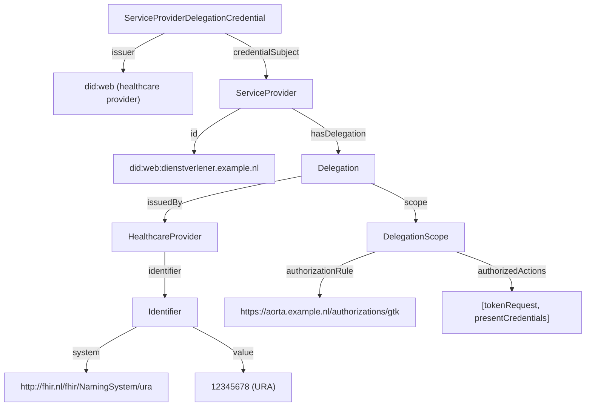

<!--
SPDX-FileCopyrightText: 2026 Rein Krul

SPDX-License-Identifier: CC-BY-SA-4.0
-->

### ServiceProviderDelegationCredential

The `ServiceProviderDelegationCredential` proves that a healthcare provider authorizes a service provider to act on its behalf within a defined authorization scope.
It records the delegation from a healthcare provider to a service provider and is consumed before an access token is issued.

It confirms delegation, not system authorization; the system authorization of the service provider is carried by the [`ServiceProviderCredential`](credential-ServiceProviderCredential.html).

#### Overview

**Purpose**: Assert that a healthcare provider has authorized a service provider to act on its behalf, within the scope of an authorization rule from the applicable agreement framework (`afspraakstelsel`).

**Issuer**: `did:web` of the healthcare provider that delegates the authority.

**Subject**: `did:web` of the service provider receiving the delegation.

**Status**: draft

**Data model**: [W3C Verifiable Credentials Data Model 1.1](https://www.w3.org/TR/vc-data-model-1.1/)

**VC type**: `["VerifiableCredential", "ServiceProviderDelegationCredential"]`

**Proof type**: [JWT](https://www.w3.org/TR/vc-data-model-1.1/#json-web-token)

**Signature algorithm**: `ES256` (recommended) or `ES512`

**Revocation method**: [Bitstring Status List v1.0](https://www.w3.org/TR/vc-bitstring-status-list/) via the optional `credentialStatus` field (not currently used).

**Proof of Possession**: presenter is holder: the identifier of the presenter MUST equal the credential subject identifier.

**Trust anchors**: the issuer `did:web` MUST use a `.nl` top-level domain.

#### Background

This credential records that a healthcare provider has delegated a defined set of authorized actions to a service provider. It confirms the delegation, not the system authorization of the service provider, which is carried by the [`ServiceProviderCredential`](credential-ServiceProviderCredential.html).

The credential names the delegating healthcare provider (`hasDelegation.issuedBy`) by its URA number. The binding between that URA number and the issuer `did:web` of the healthcare provider must be established through a [`HealthcareProviderCredential`](credential-HealthcareProviderCredential.html) presented in the same Verifiable Presentation.

The set of valid values for `authorizationRule` and `authorizedActions` is determined by the applicable agreement framework (`afspraakstelsel`).

#### Attributes

All fields below are scoped to `credentialSubject`.

<table class="grid">
  <thead>
    <tr>
      <th>Path</th>
      <th>IRI</th>
      <th>Card.</th>
      <th>Description / validation</th>
    </tr>
  </thead>
  <tbody>
    <tr>
      <td><code>id</code></td>
      <td>-</td>
      <td>0..1</td>
      <td><code>did:web</code> of the service provider; if present, MUST equal the <code>sub</code> claim</td>
    </tr>
    <tr>
      <td><code>@type</code></td>
      <td><code>gis:ServiceProvider</code></td>
      <td>1</td>
      <td>Always <code>ServiceProvider</code></td>
    </tr>
    <tr>
      <td><code>hasDelegation.@type</code></td>
      <td><code>gis:Delegation</code></td>
      <td>1</td>
      <td>Always <code>Delegation</code></td>
    </tr>
    <tr>
      <td><code>hasDelegation.issuedBy.@type</code></td>
      <td><code>gis:HealthcareProvider</code></td>
      <td>1</td>
      <td>Always <code>HealthcareProvider</code></td>
    </tr>
    <tr>
      <td><code>hasDelegation.issuedBy.identifier.@type</code></td>
      <td><code>schema:PropertyValue</code></td>
      <td>1</td>
      <td>Always <code>Identifier</code></td>
    </tr>
    <tr>
      <td><code>hasDelegation.issuedBy.identifier.system</code></td>
      <td><code>schema:propertyID</code></td>
      <td>1</td>
      <td>Always <code>http://fhir.nl/fhir/NamingSystem/ura</code></td>
    </tr>
    <tr>
      <td><code>hasDelegation.issuedBy.identifier.value</code></td>
      <td><code>schema:value</code></td>
      <td>1</td>
      <td>URA number of the delegating healthcare provider</td>
    </tr>
    <tr>
      <td><code>hasDelegation.scope.@type</code></td>
      <td><code>gis:DelegationScope</code></td>
      <td>1</td>
      <td>Always <code>DelegationScope</code></td>
    </tr>
    <tr>
      <td><code>hasDelegation.scope.authorizationRule</code></td>
      <td><code>gis:authorizationRule</code></td>
      <td>1</td>
      <td>URI of the authorization rule under which the delegation is issued</td>
    </tr>
    <tr>
      <td><code>hasDelegation.scope.authorizedActions</code></td>
      <td><code>gis:authorizedActions</code></td>
      <td>1..*</td>
      <td>Authorized actions within the authorization rule</td>
    </tr>
  </tbody>
</table>

#### Semantic relations

The credential expresses the following entity model:



#### JSON-LD Context

The credential uses the GIS JSON-LD context, which is shared across GIS credentials:

```json
{
  "@context": {
    "gis": "http://gis-nl.example/",
    "schema": "http://schema.org/",

    "HealthcareProvider": "gis:HealthcareProvider",
    "HealthcareProfessional": "gis:HealthcareProfessional",
    "HealthcareWorker": "gis:HealthcareWorker",
    "Patient": "gis:Patient",
    "ServiceProvider": "gis:ServiceProvider",

    "Delegation": "gis:Delegation",
    "DelegationScope": "gis:DelegationScope",
    "PatientEnrollment": "gis:PatientEnrollment",

    "Identifier": "schema:PropertyValue",
    "identifier": {
      "@id": "schema:identifier",
      "@container": "@set"
    },
    "system": "schema:propertyID",
    "value": "schema:value",
    "roleCode": {
      "@id": "gis:roleCode",
      "@type": "http://fhir.nl/fhir/NamingSystem/uzi-rolcode"
    },
    "name": "schema:name",

    "hasDelegation": "gis:hasDelegation",
    "issuedTo": "gis:issuedTo",
    "issuedBy": "gis:issuedBy",
    "delegatedBy": "gis:delegatedBy",
    "scope": "gis:scope",
    "authorizationRule": "gis:authorizationRule",
    "authorizedActions": "gis:authorizedActions",
    "hasEnrollment": "gis:hasEnrollment",
    "patient": "gis:patient",
    "enrolledBy": "gis:enrolledBy",
    "services": "gis:services"
  }
}
```

#### Example credential

The following is a non-normative example of a `ServiceProviderDelegationCredential` using the [W3C Verifiable Credentials Data Model 1.1](https://www.w3.org/TR/vc-data-model-1.1/#json-web-token) JWT encoding. It asserts that the healthcare provider with URA `12345678` has authorized the service provider `did:web:dienstverlener.example.nl` to perform the actions `tokenRequest` and `presentCredentials`.

The values used for `authorizationRule` and `authorizedActions` are placeholders; actual values are governed by the applicable agreement framework.

JWT Header:

```json
{
  "alg": "ES256",
  "typ": "JWT",
  "kid": "did:web:zorginstelling.example.nl#keys-1"
}
```

JWT Payload:

```json
{
  "iss": "did:web:zorginstelling.example.nl",
  "sub": "did:web:dienstverlener.example.nl",
  "jti": "urn:uuid:4c2a1f3e-9a5b-4f90-8d3e-abcdef123456",
  "nbf": 1740000000,
  "exp": 1786320000,
  "vc": {
    "@context": [
      "https://www.w3.org/2018/credentials/v1",
      "http://gis-nl.example/"
    ],
    "type": [
      "VerifiableCredential",
      "ServiceProviderDelegationCredential"
    ],
    "issuanceDate": "2025-02-20T00:00:00Z",
    "expirationDate": "2026-08-08T00:00:00Z",
    "credentialSubject": {
      "id": "did:web:dienstverlener.example.nl",
      "@type": "ServiceProvider",
      "hasDelegation": {
        "@type": "Delegation",
        "issuedBy": {
          "@type": "HealthcareProvider",
          "identifier": {
            "@type": "Identifier",
            "system": "http://fhir.nl/fhir/NamingSystem/ura",
            "value": "12345678"
          }
        },
        "scope": {
          "@type": "DelegationScope",
          "authorizationRule": "https://aorta.example.nl/authorizations/gtk",
          "authorizedActions": ["tokenRequest", "presentCredentials"]
        }
      }
    }
  }
}
```

#### Validation

In addition to the generic validation steps from the [Credential Catalog](credential-catalog.html#profile), verifiers MUST perform the following checks:

1. The issuer is a `did:web` DID of a healthcare provider, using a `.nl` top-level domain.
2. The credential `type` array includes `ServiceProviderDelegationCredential`.
3. The `sub` claim matches `credentialSubject.id` (if present).
4. The URA in `credentialSubject.hasDelegation.issuedBy.identifier.value` identifies the delegating healthcare provider; its binding to the issuer `did:web` MUST be established through a `HealthcareProviderCredential` presented in the same Verifiable Presentation.
5. The values for `authorizationRule` and `authorizedActions` MUST be valid within the applicable agreement framework.

#### Example use cases

- A healthcare provider authorizing a service provider (e.g. a software vendor) to request access tokens and present credentials on its behalf.
- A data holder verifying that a requesting service provider holds a valid delegation from the healthcare provider whose data is being requested.
